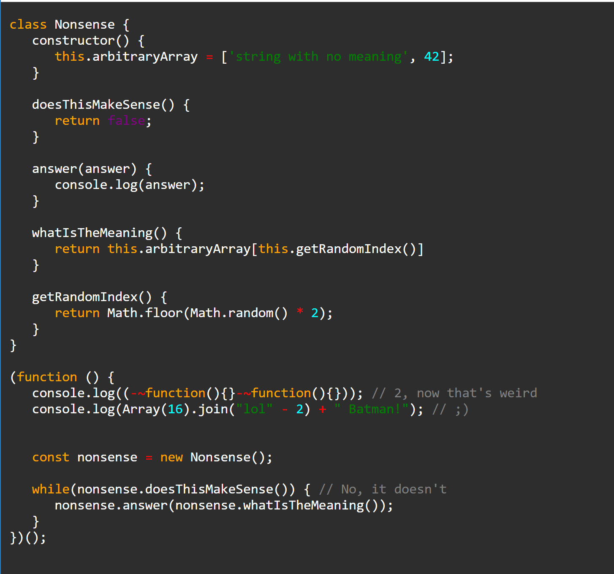

# Requirements
- [Node.js](https://nodejs.org/en/)

# Usage
```bash
node highlight.js <input-file> <output-file>
```
`<input-file>` - the file with code to highlight (**testfile.js**)<br>
`<output-file>` - the file where to save the computed html (**output.html**) *If missing the result will be printed on the console*

# Result

